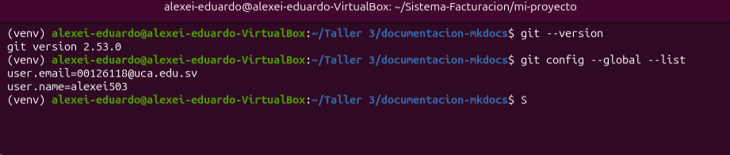

# Instalación de Git

Git está disponible para Windows, Linux y macOS.

## Instalación en Ubuntu

Actualiza los repositorios:

```bash
sudo apt update
```

Instala Git:

```bash
sudo apt install git -y
```

Verifica la instalación:

```bash
git --version
```

## Configuración inicial

Configura tu nombre de usuario:

```bash
git config --global user.name "Tu Nombre"
```

Configura tu correo electrónico:

```bash
git config --global user.email "correo@ejemplo.com"
```

## Imagen de referencia



!!! note "Importante"
    Configurar correctamente el nombre y correo permite identificar quién realizó cada cambio en el repositorio.

Volver al [Inicio](index.md).
